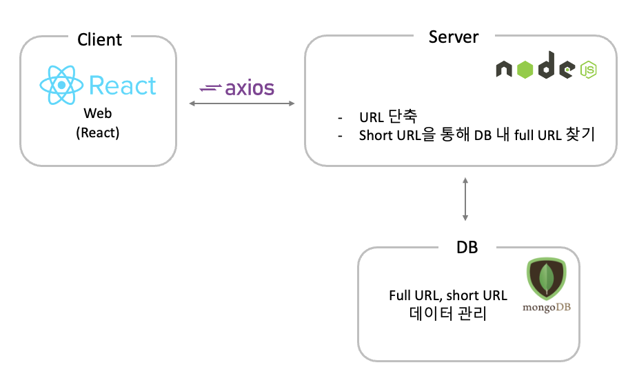

# 🔎 개인 프로젝트\_URL Shortner

## 프로젝트 개요

URL 입력폼에 URL을 입력하면 단축 후 결과를 출력하는 서비스

## 📚 Tech Stack

 
 
   
   
  
   
  
  
  

## 🛠 Architecture

## 와이어프레임 초안

## 📝 주요 작업 및 기능

- URL 입력폼 제공
- 단축 후 결과 출력
- 동일한 URL을 입력할 경우 **항상 동일한 shortening 결과 값** 출력
- shortening 의 결과 값은 **8문자 이내**로 생성
- 브라우저에서 shortening URL을 입력하면 **원래 URL로 리다이렉트**
- 도메인은 **localhost**로 처리

## ⚙️ 리팩토링 한 부분

- 기존에 짜여진 로직은 틀린 알고리즘이라는 피드백을 받았고, 수정해서 url을 단축함
  - 기존 알고리즘  
    입력 url을 암호화하고 8자리로 잘라서 shortUrl로 db에 저장하고 shortUrl을 원래 url로 바꿀 때는 db에서 shortUrl을 찾아 리다이렉트하는 방식
  - 수정 알고리즘  
    입력 url을 db에 저장하고 해당 db index ID를 base62를 통해 인코딩해서 암호화하고 원래 url로 복구할 때는 base62를 통해 디코딩해 db에서 검색해 원본주소로 리다이렉트하는 방식

## ✔️ 피드백이 필요하다고 느껴지는 부분

- Q. URL을 단축하는 로직을 `backend`폴더 내 `shortalgorithm`폴더의 `ShortLogic.js`파일에 구현해두었는데, 괜찮은 방식으로 짜여진 로직인지에 대해 여쭤보고 싶습니다.
  - A. 1차로 구현된 로직은 틀린 방향이라 개선이 필요함
- Q. 현재는 mongoDB를 활용해 **DB에서 일치하는 shortURL이 있으면 fullURL로 리다이렉트**하는 방식으로 구현되어있습니다.  
  구현을 진행하다보니 **DB를 사용하지 않고 fullURL을 인코딩해서 shortURL로 사용하고, 리다이렉트 시 디코딩하는 방식**으로도 구현이 가능할 것이라는 생각이 들었습니다.  
  두 가지 방식 중에 더 나은 방식은 어느 방향인지 궁금합니다.
  - A. 둘 중에 어떤 방식이 옳다고 할 수는 없다. 상황마다 어떤 방식이 나을지 고민해서 구현하면 됨
- Q. 이번 프로젝트에서 `Node.js`를 처음 배우고 구현해보았는데 코드 작성 순서나 파일 분리 방식에서 현재 방식이 맞는지, 어떻게 개선해야하는지 궁금합니다.
  - A.이런 방식으로 분리하면 됨
